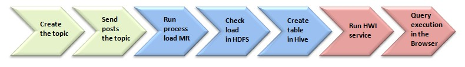

## Intro

Project Openbus

# Openbus: Logs to Kafka to Hadoop 
In this subproject will be collected openbus activity logs of different web application servers be sent to Kafka broker that handles distribution. Camus will use the project to subscribe to topics and throw a load Map Reduce task messages in HDFS.

In this subproject will be collected openbus activity logs of different web application servers be sent to Kafka broker that handles distribution. Camus will use the project to subscribe to topics and throw a load Map Reduce task messages in HDFS.

# Architecture diagram

# Steps

The steps that we will continue to carry out the project are:

- **Create the topic**

*sudo /data/software/kafka-0.8.0-beta1-src/bin/kafka-create-topic.sh --zookeeper [host]:2181 --replica 1 --partition 1 --topic rawtext*

- **Send messages the topic**

- **Run process MapReduce that loads messages Camus in HDFS**

*cd /home/[user]/camus/target
hadoop jar camus-example-0.1.0-SNAPSHOT-shaded.jar com.linkedin.camus.etl.kafka.CamusJob -P camus-apachelog.properties*

- **Check load to the messages in HDFS**

*hadoop fs -get /user/[user]/etl/apacheLogAvro/*

*java -jar ../../avro/avro-tools-1.7.5.jar tojson apacheLogAvro/hourly/[year]/[month]/[day]/[hour]/apacheLogAvro.X.X.XX.XX.avro*

- **Create table in Hive**

Run hive

*add jar /home/[user]/libs/hive-serde-0.11.0.jar ;* 

*add jar /home/[user]/libs/hive-exec-0.11.0.jar ;* 

*CREATE EXTERNAL TABLE apacheLogTable
        ROW FORMAT SERDE 'org.apache.hadoop.hive.serde2.avro.AvroSerDe'
            STORED AS
                INPUTFORMAT  'org.apache.hadoop.hive.ql.io.avro.AvroContainerInputFormat'
                OUTPUTFORMAT 'org.apache.hadoop.hive.ql.io.avro.AvroContainerOutputFormat'
                LOCATION '/user/[user]/hivetest' TBLPROPERTIES ('avro.schema.url'='hdfs:///user/[user]/apacheLogAvro.avsc');*

*show tables;*

- **Run Hive Web Interface (HWI)**

*hive --service hwi*

- **Query execution in the Browser**

http://[host]:9999/hwi/session_result.jsp?sessionName=LogAvro20131017

**Create or List session**

**Add resources:**

*add jar /home/juliansimon/libs/hive-serde-0.11.0.jar ;* 

*add jar /home/juliansimon/libs/hive-exec-0.11.0.jar ;*

**Query**

*desc apacheLogTable;*

*select count(*) from apacheLogTable;*

*select * from apacheLogTable limit 30;*

*select session from apacheLogTable group by session;*
